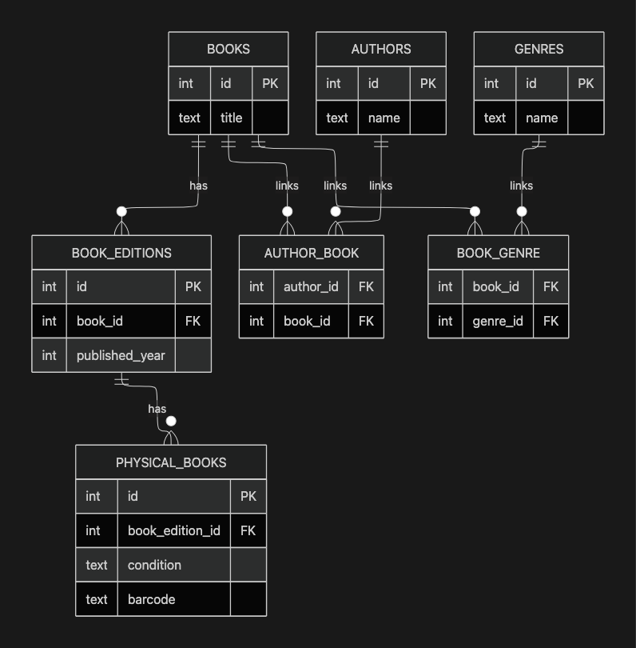

# Database Normalization
This is my practical implementation of Database Normalisation specifically 5NF, from my first session with Colin through FCDC.
I'll be using Express/nodejs for my backend, and better-sqlite3 For the library database.

## Database
A practical library database would usually have a couple of tables which include; 
- Users(Librarian, user), Users table would consist of a couple of columns
   |  name  | phone | username | passwords | Role |
   |--------|-------|----------|-----------|------|
   |John Doe|0628***|  JDoe    |jjkj*h82h92| User |
   |Alice carter|05643**| Alice | iown!0-@34|Librarian|
- Books table, a book table would be more complex than a user table. Books have more characteristics in them, which include genres, authors, editions, physical books etc. All these details would not fit in one table, putting them in one table would violate the 1NF rule which states that columns in table should manitain atomicity, only one value should be inside a column. So since I have to adhere to this rule, I had to create a table for each book trait and link them to their respective book.
  
